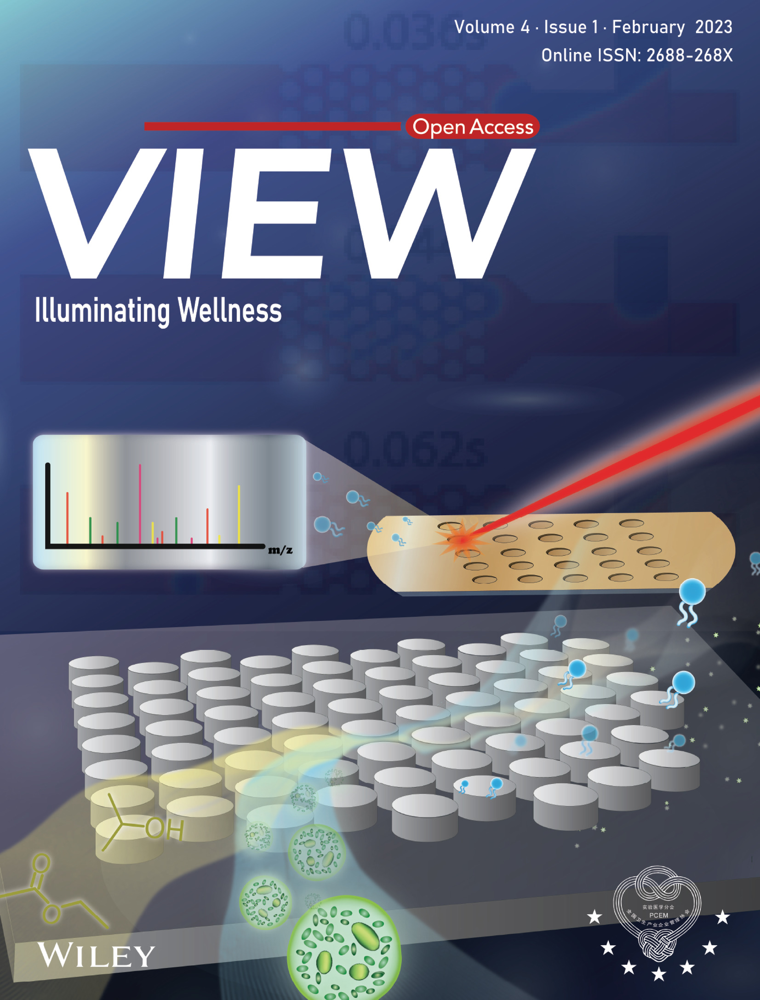

<html>

</html>

<a href="https://pubs.acs.org/doi/10.1021/acs.analchem.9b05285" target="_blank" rel="noreferrer noopener">{: width="300" }</a>
<a href="https://onlinelibrary.wiley.com/doi/10.1002/VIW.20220041" target="_blank" rel="noreferrer noopener">{: width="300" }</a>

If you are interested in my publications a list is provided below. They can also be found on my [ResearchGate](https://www.researchgate.net/profile/Daniel-Stuart-8), or [ORCID](https://orcid.org/0000-0001-6282-9373) pages.

## Publications ##

1. Surface Plasmon Resonance Imaging and Microscopy Modalities for Information-Rich, Label-Free Analysis of Biomolecular Interactions and Disease Biomarkers  
[Victor A Hanson, Westley Van Zant, Cole P Ebel, Alexander S Malinick, Daniel D Stuart, Luke N Stemple, Quan Cheng <em> Chemical & Biomedical Imaging </em> <strong>2026 </strong>](https://pubs.acs.org/cbihbp/article/4/7/1315/5234141/Surface-Plasmon-Resonance-Imaging-and-Microscopy)
2. Indium Plasmonic Thin Films as Substrates for Kretschmann Configuration-Based SPR Sensing and FDTD Analysis of Oxide-Enhanced UV-SERS  
[Cole P Ebel, Daniel D Stuart, Santino N Valiulis, Westley Van Zant, Quan Cheng <em> ACS Applied Nano Materials </em> <strong>2025 </strong>](https://pubs.acs.org/aanmf6/article-abstract/8/48/23237/3650870/Indium-Plasmonic-Thin-Films-as-Substrates-for)
3. Curvature-tuning membrane mimetics as novel sensing interface to probe affinity fluctuation of bridging integrator 1 protein by SPR  
[Alexander S Malinick, Daniel D Stuart, Cole P Ebel, Westley Van Zant, David Rizvi, Jasmine Gutierrez, Quan Cheng <em> Biosensors and Bioelectronics </em> <strong>2025 </strong>](https://www.sciencedirect.com/science/article/abs/pii/S0956566325005871)
4. Surface-Tethered Curved Membrane Mimics for Characterizing Alpha Synuclein-Membrane Interactions by Surface Plasmon Resonance  
[Quan Cheng, Westley Van Zant, Daniel Stuart, Alexander Malinick, Cole Ebel <em> ChemRxiv </em> <strong>2025 </strong>](https://chemrxiv.org/doi/full/10.26434/chemrxiv-2025-lps7x)
5. Plasmonic Aluminum Thin Films as Substrate Materials for Label-Free Optical Detection and Surface-Enhanced MALDI Mass Spectrometry  
[Alexander S Lambert, Santino N Valiulis, Alexander S Malinick, Daniel D Stuart, Quan Cheng <em> ACS Applied Engineering Materials </em> <strong>2025 </strong>](https://pubs.acs.org/aaemdr/article-abstract/3/2/357/3659768/Plasmonic-Aluminum-Thin-Films-as-Substrate)
6. Versatile Au nanozyme Raman probe strategy for ultrasensitive encoded photonic crystal-based SERS multiplex immunosensing  
[Jiayin Li, Linan Yang, Feng Shi, Yan Long, Yuru Wang, Daniel D Stuart, Hongbo Li, Quan Cheng, Lingfeng Min, Zhanjun Yang, Juan Li <em> Chinese Chemical Letters </em> <strong>2025 </strong>](https://www.sciencedirect.com/science/article/abs/pii/S1001841725000701)
7. Surface Plasmon Resonance to Trace and Measure Cancer Cell Apoptosis using Morphological and Refractive Index Changes  
[Nor Akmaliza Rais, Fatimah Abouhajar, Daniel D. Stuart, Westley Van Zant and Quan Cheng <em> Front. Anal. Sci. </em> <strong>2024 </strong>](https://doi.org/10.3389/frans.2024.1518243)
8. Novel and Rapid Analytical Platform Development Enabled by Advances in 3D Printing  
[Alexander S. Malinick, Cole P. Ebel, Daniel D. Stuart, Santino N. Valiulis, Victor A. Hanson and Quan Cheng <em> Front. Anal. Sci. </em> <strong>2024 </strong>](https://doi.org/10.3389/frans.2024.1518243)
9. Characterization of a Charged Biomimetic Lipid Membrane for Unique Antifouling Effects against Clinically Relevant Matrices in Biosensing  
[Daniel D. Stuart, Caleb D. Pike, Alexander S. Malinick, and Quan Cheng <em> ACS Applied Materials & Interfaces </em> <strong>2024 </strong>](https://pubs.acs.org/doi/10.1021/acsami.4c14563)
10. Trends in surface plasmon resonance biosensing: materials, methods, and machine learning  
[Daniel D. Stuart, Westley Van Zant, Santino N. Valiulis, Alexander S. Malinick, Victor Hanson and Quan Cheng <em> Anal Bioanal Chem </em> <strong>2024 </strong>](https://link.springer.com/article/10.1007/s00216-024-05367-w)
11. Curved Membrane Mimics for Quantitative Probing of Protein–Membrane Interactions by Surface Plasmon Resonance  
[Alexander S. Malinick, Daniel D. Stuart, Alexander S. Lambert, and Quan Cheng <em> ACS Applied Materials & Interfaces</em> <strong>2024 </strong>](https://pubs.acs.org/doi/full/10.1021/acsami.3c12922)
12. Label-Free Analysis of Binding and Inhibition of SARS-Cov-19 Spike Proteins to ACE2 Receptor with ACE2-Derived Peptides by Surface Plasmon Resonance  
[Fatimah Abouhajar, Rohit Chaudhuri, Santino N. Valiulis, Daniel D. Stuart, Alexander S. Malinick,  Min Xue, and Quan Cheng <em>ACS Applied Bio Materials</em> <strong>2022</strong>](https://doi.org/10.1021/acsabm.2c00832)
13. Biosensing empowered by molecular identification: Advances in surface plasmon resonance techniques coupled with mass spectrometry and Raman spectroscopy   
[Daniel D. Stuart, Cole P. Ebel, and Quan Cheng <em>Sensors and Actuators Reports</em> <strong>2022</strong>, 100129](https://doi.org/10.1016/j.snr.2022.100129)
14. Three-dimensional printed microfluidic mixer/extractor for cell lysis and lipidomic profiling by matrix-assisted laser desorption/ionization mass spectrometry  
[Zhengdong Yang, Bochao Li, Daniel D. Stuart, and Quan Cheng <em>View</em> <strong>2022</strong>, 0041](https://doi.org/10.1002/VIW.20220041)
15. Intelligent Hydrogen Gas Monitoring in Natural Gas/Hydrogen Blending  
[Bryce Davis,  Daniel D. Stuart, Mary N. Maldonado, Venkat Kamavaram,  Quan Cheng, and Vinod Veedu <em>Offshore Technology Conference</em> <strong>2022</strong>](http://dx.doi.org/10.4043/32007-MS)
16. Probing Herbicide Toxicity to Algae (Selenastrum capricornutum) by Lipid Profiling with Machine Learning and Microchip/MALDI-TOF Mass Spectrometry  
[Bochao Li, Daniel D. Stuart, Peter V. Shanta, Caleb D. Pike, and Quan Cheng <em>Chemical Research in Toxicology</em> <strong>2022</strong> 35 (4), 606-615](http://dx.doi.org/10.1021/acs.chemrestox.1c00397)
17. Surface Plasmon Resonance Imaging (SPRi) in Combination with Machine Learning for Microarray Analysis of Multiple Sclerosis Niomarkers in Whole Serum  
[Alexander S. Malinick, Daniel D. Stuart, Alexander S. Lambert, Quan Cheng <em>Biosensors and Bioelectronics: X</em> <strong>2022</strong> 10, 100127](http://dx.doi.org/10.1016/j.biosx.2022.100127)
18. Lipidomic Profiling of Algae with Microarray MALDI-MS toward Ecotoxicological Monitoring of Herbicide Exposure  
[Peter V. Shanta, Bochao Li, Daniel D. Stuart, and Quan Cheng <em>Environmental Science & Technology</em> <strong>2021</strong> 55 (15), 10558-10568](http://dx.doi.org/10.1021/acs.est.1c01138)
19. Detection of Multiple Sclerosis Biomarkers in Serum by Ganglioside Microarrays and Surface Plasmon Resonance Imaging  
[Alexander S. Malinick, Alexander S. Lambert, Daniel D. Stuart, Bochao Li, Ellie Puente, and Quan Cheng <em>ACS Sensors</em> <strong>2020</strong> 5 (11), 3617-3626](http://dx.doi.org/10.1021/acssensors.0c01935)
20. Plasmonic Gold Templates Enhancing Single Cell Lipidomic Analysis of Microorganisms  
[Peter V. Shanta, Bochao Li, Daniel D. Stuart, and Quan Cheng <em>Analytical Chemistry</em> <strong>2020</strong> 92 (9), 6213-6217](http://dx.doi.org/10.1021/acs.analchem.9b05285)
21. Graphene Oxide-Nanocarriers for Fluorescent Sensing of Calcium Ion Accumulation and Direct Assessment of Ion-Induced Enzymatic Activities in Cells   
[Peter V. Shanta, Daniel D. Stuart, and Quan Cheng <em>ACS Applied Nano Materials</em> <strong>2019</strong> 2 (9), 5594-5603](http://dx.doi.org/10.1021/acsanm.9b01160)

## Presentations ##

1. PUC to PhD: Biosensing and Bioinformatics  
Pacific Union College, Angwin, CA (November 14, 2024)

2. Rapid MALDI-MS Based Identification of Methicillin Resistance and Bacterial Strain Classification Enabled by Machine Learning  
UC Chemical Symposium, UCLA Lake Arrowhead Lodge, CA (April 9, 2024)  
Awarded Best Environmental & Analytical Division Talk

3. Understanding Pressure and Refractive Index Relationships to Enable Gas Sensing by Surface Plasmon Resonance  
UC Chemical Symposium, UCLA Lake Arrowhead Lodge, CA (April 24, 2023)  
Awarded Best Analytical Division Talk

4. Biomimetic Lipid Membranes as Effective Antifouling Interfaces for Sensing in Clinically Relevant Matrices  
SciX 2022, Microfluidic Bioanalysis (October 4, 2022)

5. Biomimetic Lipid Membranes for Effective Antifouling on a Biosensor Surface with Clinically Relevant Matrices  
Pittcon 2022, Bioanalytics & Life Science, Virtually (April 5, 2022)  
 
6. Membrane Mimics Towards Novel Interfaces and Study of Biomolecular Interactions  
UCR, Analytical Chemistry Seminar, Virtually (January 20, 2021)

7. Characterization of Transport of Drug Analogs through Membrane Mimics with SPR Spectroscopy and MALDI-MS  
Pittcon Conference and Expo, McCormick Place, Chicago, IL (March 4, 2020)  
		
8. Novel Characterization of Drug Analog Membrane Transport Through Coupled SPR-MALDI Analysis  
UC Chemical Symposium, UCLA Lake Arrowhead Lodge, CA (March 25, 2019)  

